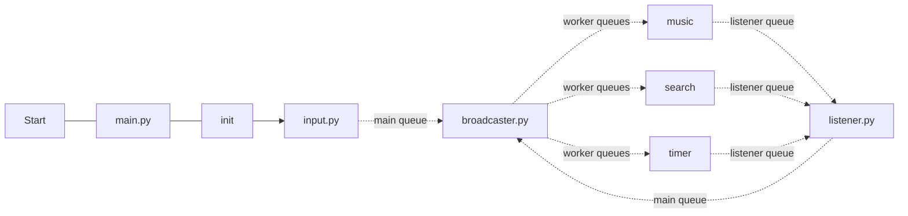
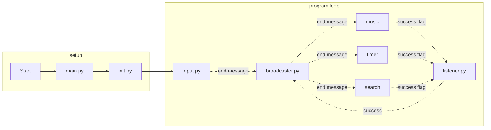

# Asynchronous Assistant
A CLI assistant using Priority Queues and Threading with an architecture enabling scalability and compartmentalization. The project is currently just a rough sketch with bare bones testing and lacking implementation of modules. Despite this, it is a fully functioning architecture which can scale very well.

## Features

 1. **Fast** - using ONNX models to streamline embeddings and make the app faster and efficient even on slower systems which might not be equipped with fast GPUs.
 2. **Scalable** - uses a broadcaster-worker-listener architecture to allow each module a seperate queue for seperation of concerns and concurrancy.
 3. **Tested** - uses the `unittest` module in python to ensure maximum code coverage.
## Installation
Before you begin ensure you have **Python 3** and **uv** python manager installed and configured properly.

    # If uv isnt installed already
    pip install uv
    
    # Clone the project
    git clone https://github.com/Jeet-Bubna/Asynchronous-Assistant.git
    
    # Go into the directory
    cd Asynchronous-Assistant
    
    # Sync the packages
    uv sync
    
    # Optional - Activate the venv
    source .venv/bin/activate # .venv\Scripts\activate for Windows (🤮)
   
   ## Usage
To start the assistant, simply run:

    uv run main.py

## Architecture
The program uses a **broadcaster-worker-listener** architecture, with a main queue, several worker queues, and a listener queue. 

To make the program more thread safe, the status of programs are managed by the `threading.Event()` class.

When ending, the flow of Packets is

And like this, the process ends. At each step, after doing their due diligence, the associated function returns with a status code. If the status code is positive, the program moves on. Otherwise, methods are applied to make sure that the worker is joined.

If a problem occurs, such that a worker, for example music is unable to return due to an error or a library issue, then the problem is reported to the listener, which sends a Packet to the main queue which lets the broadcaster to act on the specific error and act on it.

All the queues are `threading.PriorityQueue` classes which allows for fast travel of more important or time consuming commands in front of the less important or time consuming commands.

## Contact
Community feedback is greatly appreciated. Please contact me at
bubnajeet@gmail.com
Thanks!