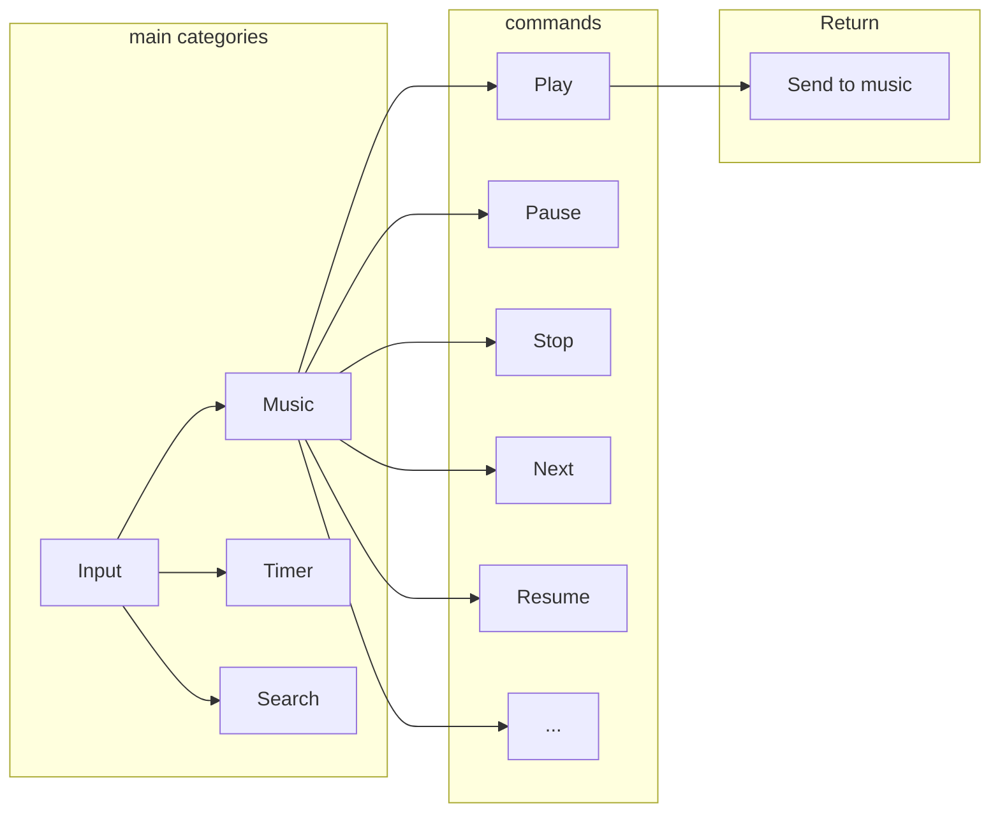
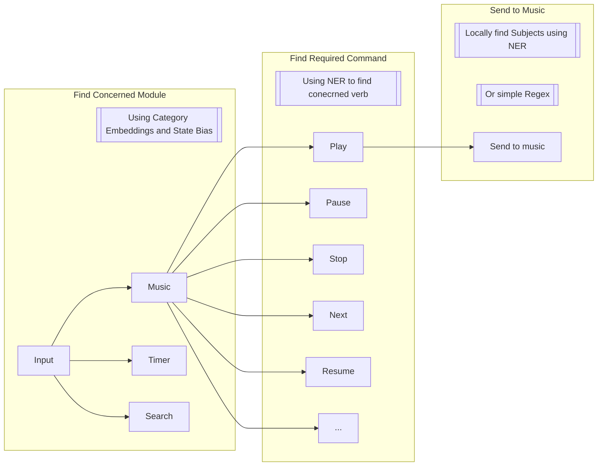

# Categorization Problem
*A continuation of Sub-Categorization Problem*  

## Problem

In the previous exploration, we discussed 4 ways of sub-categorization. Namely - **Global Categorization, In-Function Categorization, Regex-Based Sub-Categorization and Mixed Categorization**. While researching about better ways, I came to the conclusion that Global Categorization was the best as it  gave us the option to employ more advanced semantic and logical methods of sub-categorization in the global `input` itself.
  

## Method Overview

The processes for the new categorization function will be described in this section.
### Core Processes
1. **Vector Space Partitioning**: The basic idea is that we first find the best match for the function which is concerned, and then reduce the l2 calculations by applying cosine similarities to only sub-commands of the concerned module. This is illustrated by this diagram.

In this, Instead of calculating cosine similarities for every command in every module, we select a main category (by using a state variable to assign higher priority to the one which is active) and find `argmax` of the command in that module.

2. **State Bias**: A good rule of thumb is we should not let the user worry too much about specifying what they mean exactly. The assistant should be smart enough to identify certain patterns which make the life of the user easier. For this, we should not expect the user to say 'Jarvis, end the music'. We expect them to say 'Jarvis, stop' or 'Jarvis, cut it off'. Now, if we hardcore these sentences into the `embeddings_list`, the embeddings model may get confused when it finds 'stop' command in both timer and music. For this, we simply find which workers are active, using the `threading.Event` flags, and apply a `ACTIVE_MULTIPLIER` which boosts the cosine similarity in the first categorization step to ensure that stop command is sent to the music module when it is active. For this, we may use a matrix with columns representing whether or not the module is active and multiplying the two matrices (ie. the state bias matrix and the embeddings matrix) and then calculate dot product.
 After some more thought, Active Multiplier might be a bad solution as it might overshadow the module part. For example, when I say Start another timer, it might route to a already started module, like music because of the multiplier. A better approach would be to add a product of the State and a hyper-tuned parameter. It would look something like:
 $$S = \cos(\theta) + (\beta \cdot A)$$
 Where:
  $\cos(\theta)$ is the raw cosine similarity
 $\beta$ is the **state variable**, 1 for active and 0 for dormant
 $A$ is the **hyper-tuned factor**, something like 0.15 which acts like a bias.

	**Bottleneck**: What if two or more modules are active? How do we differentiate importance? Do we make a decay function and let $\beta$ depend on that? But that makes it such that longer running functions are prioritized. What if we started music by mistake and want to immediately close it? That's an edge case which will be uncertain using decay function. If we make it such that it prioritizes shorter functions, a timer which runs in the background may be hard to shut down. Perhaps the best solution is just to prompt the user for more specification. 

4.  **Semantic Slot Filling**: Using `fastText` or `GLiNER`, FOSS ML libraries, we can categorize the words based on intent and action (Named Entity Recognition or NER). This can be used after the main selection of modules have been done, by vector space partitioning. For example, if we know we have to play the music, we can use semantic slot filling to find out what to play by categorizing words and phrases to mean subjects, music albums, actions, etc. This will allow the logic of playing music to be done in the categorizer itself. On further research, `GLiNER` may be too expensive for every input. Hmm perhaps using regex as a precondition to reduce resources might be more effective.
## Conclusion 
I have decided that i am going to use this process for my categorization. First step is just branching the repo to allow for this, and then I am gonna abstract the logic into a new file `categorizer.py`, a thought crossed my mind about doing this in C, but then `numpy` is written in C, so we wont get any major performance changes. Seeing this, I am going to stick with python, maybe implement the music function in C for better control over the MPEG-DASH streaming system. (After some research, there already exist libraries which implement them which are written in C so I will be using them).
So the final flow is:

This is the flow. Now, we let the concerned module do NER on its own to allow flexibility. Some simple ones (like search) don't need NER, and simple regex should suffice. So we allow for better customization for the modules. 